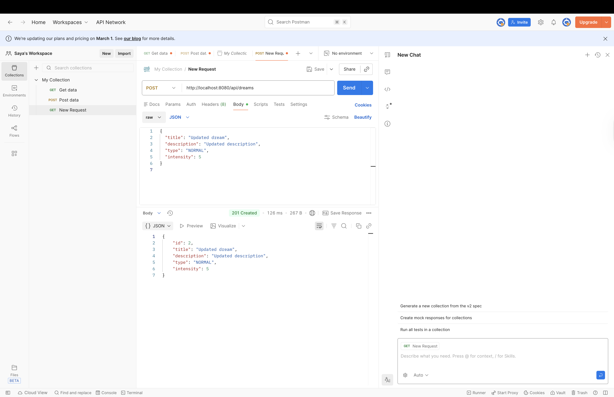
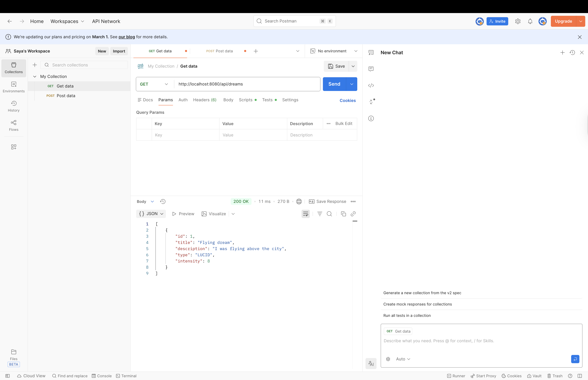
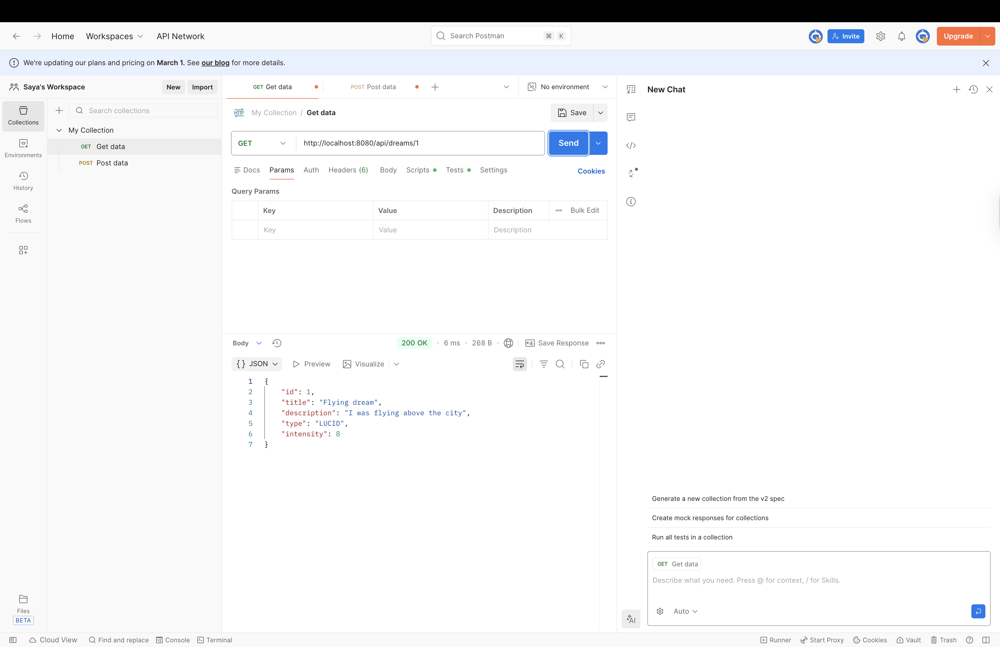
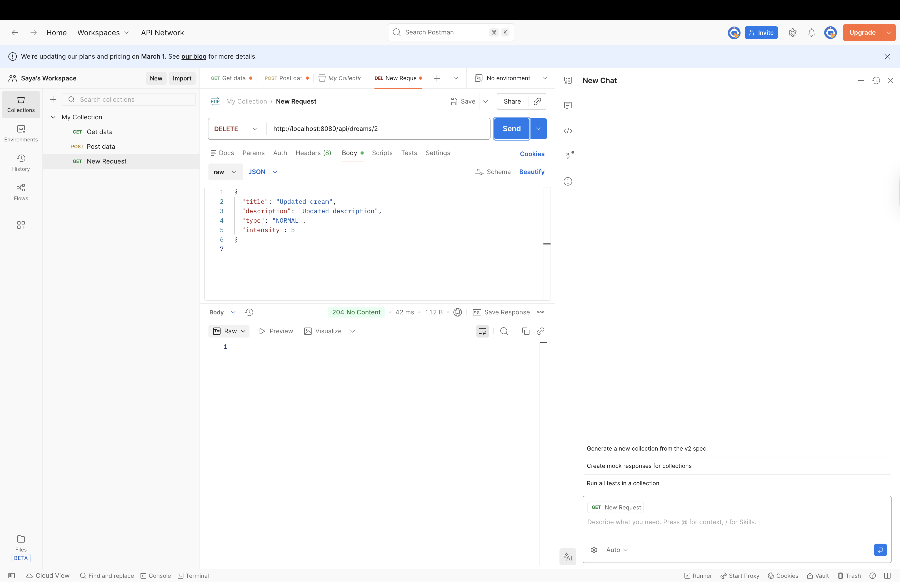
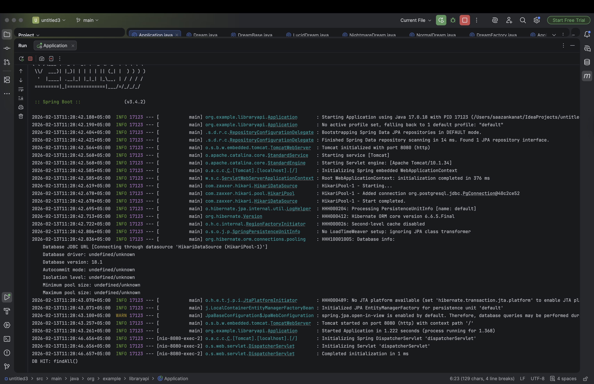
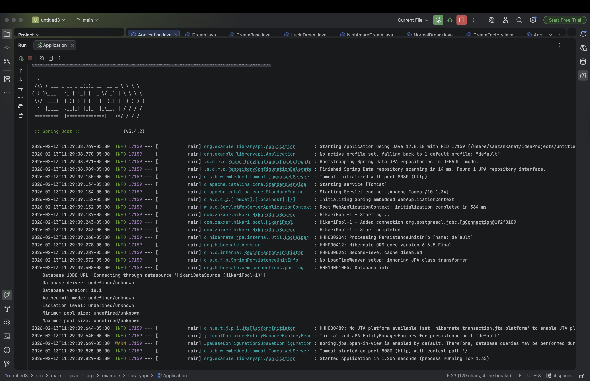
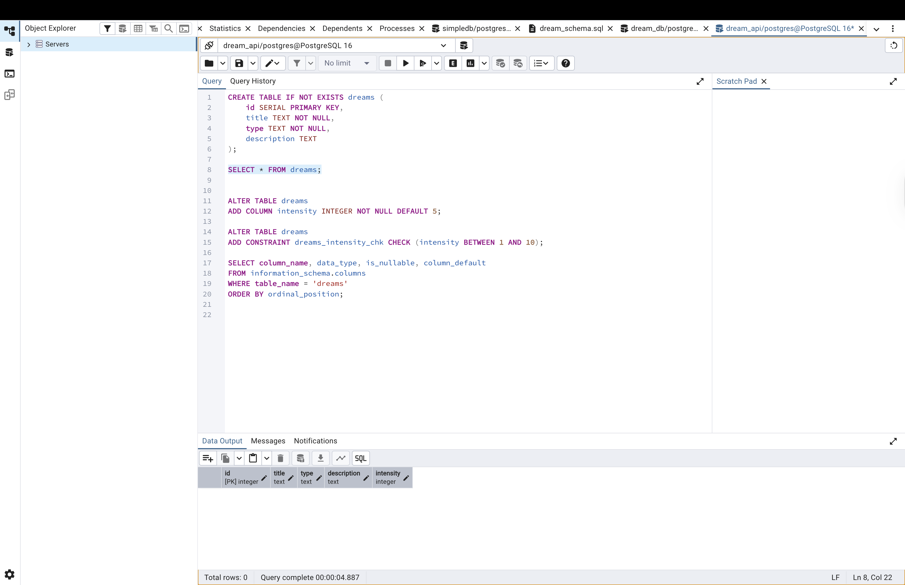
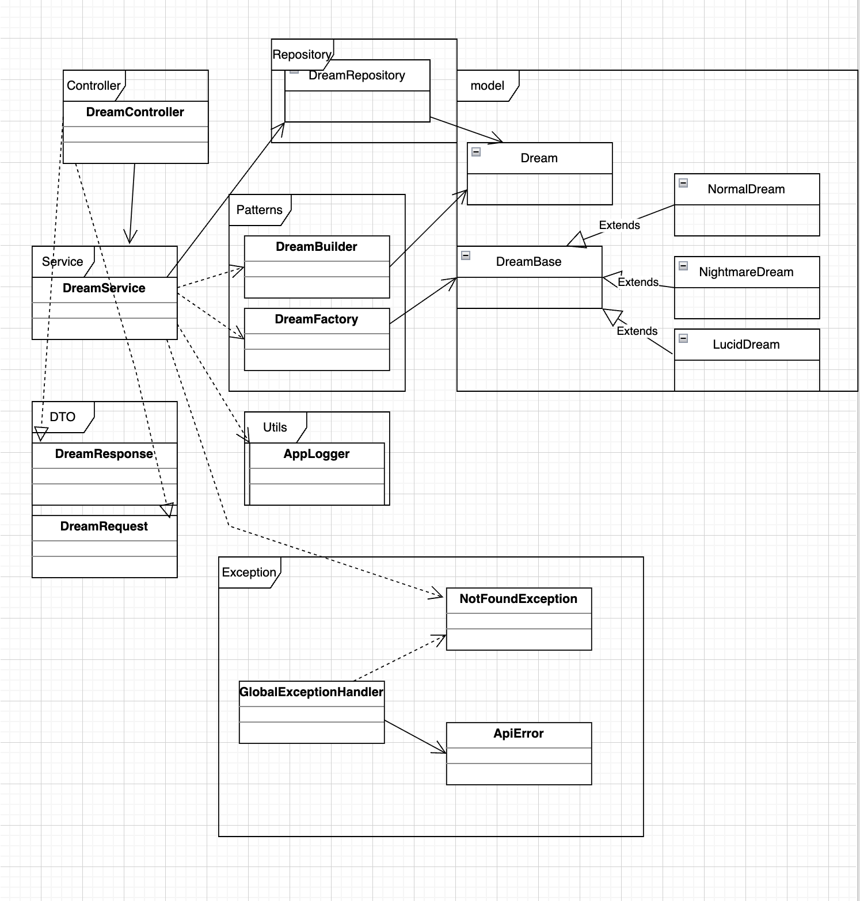

# Dream API — Endterm Project

## A. Project Overview
Dream API is a RESTful Spring Boot application that manages Dream entities and provides full CRUD functionality via a JSON-based REST API.

The project demonstrates:
- REST architecture and HTTP status codes
- Layered application design
- Object-Oriented Programming principles
- Design patterns usage
- Database integration
- Global exception handling
- API testing using Postman

---

## B. REST API Documentation

### Endpoint List

| Method | Endpoint | Description | Status |
|------|---------|------------|--------|
| POST | /api/dreams | Create a new dream | 201 |
| GET | /api/dreams | Get all dreams | 200 |
| GET | /api/dreams/{id} | Get dream by ID | 200 / 404 |
| PUT | /api/dreams/{id} | Update dream by ID | 200 |
| DELETE | /api/dreams/{id} | Delete dream by ID | 204 |

### Sample JSON Requests & Responses

#### Create Dream (POST)
```json
{
  "title": "Flying dream",
  "description": "I was flying above the city",
  "type": "LUCID",
  "intensity": 8
}
```

### Response

```json
{
  "id": 1,
  "title": "Flying",
  "description": "I was flying over the city",
  "type": "LUCID",
  "intensity": 8
}
```
### Error Response Example (404 Not Found)
```json
{
  "message": "Dream not found: 999",
  "status": 404,
  "timestamp": "2026-02-08T10:40:00"
}
```
The same JSON structure is used for PUT requests, and GET responses return identical objects.


### Postman Screenshots
All endpoints were tested in Postman.

Screenshots are located in:

- docs/screenshots/

Embedded proof (screenshots):
- POST (201 Created)

- GET all (200 OK)

- GET by id (200 OK)

- PUT (200 OK)

- DELETE (204 No Content)

- GET after delete (404 Not Found)

---

## C. Design Patterns Section
### Singleton
**Class**: AppLogger

**Purpose**: Ensures a single shared logger instance across the application to keep logging consistent and centralized.

### Factory
**Class**: DreamFactory

**Purpose**: Encapsulates creation logic for different dream types (e.g., NormalDream, LucidDream, NightmareDream) based on the input type.

### Builder
**Class**: Dream (Builder inside the model)

**Purpose**: Simplifies constructing Dream objects with optional fields and improves readability (fluent style).

---

## Bonus Task — Caching Layer (Simple In-Memory Cache)

A simple in-memory caching mechanism was implemented to improve performance
for frequently requested data.

### Cache Design
- Implemented DreamCache using the Singleton pattern
- Cache is stored in memory (JVM)
- Only one cache instance exists during application runtime

### Cached Operation
- Cached service method: DreamService#getAll()
- Endpoint affected: GET /api/dreams

### Behavior
- First request → Cache MISS → Database query executed (DB HIT)
- Subsequent requests → Cache HIT → Data returned from memory
- Database is not queried while cache is valid

### Cache Invalidation
To prevent stale data, cache is cleared automatically after:

- create(...)
- update(...)
- delete(...)

### Verification
Cache behavior was verified via console logs:

- First GET request triggers "DB HIT: findAll()"
- Repeated GET requests return cached data without hitting the database

First request (Cache MISS → Database accessed):


Repeated request (Cache HIT → No database access):


---

## D.  Component Principles Section

### REP (Reuse-Release Equivalence Principle)

Related classes that are released/changed together are grouped into cohesive packages (controller, service, repository, dto, exception, patterns, utils).

### CCP (Common Closure Principle)

Changes in business rules primarily affect the service layer, reducing the impact on controllers and other components.

### CRP (Common Reuse Principle)

DTOs, exceptions, patterns, and utils are separated into distinct packages to prevent unnecessary coupling and improve reuse.

---

## E. SOLID & OOP Summary

- S (Single Responsibility): Controllers handle HTTP, services handle business logic, repositories handle data access.

- O (Open/Closed): New dream types can be added via new subclasses without changing existing logic heavily.

- L (Liskov Substitution): Dream subtype objects can be used where the base type is expected.

- I (Interface Segregation): Layers expose only what is needed for their purpose.

- D (Dependency Inversion): Service depends on repository abstraction/contract (data access separated from business logic).

OOP features used:

- Encapsulation in models and DTOs

- Inheritance for dream type hierarchy

- Polymorphism via base dream type + subclasses

---

## F. Database Schema

Database: **dream_api (PostgreSQL)**
Main table: **dreams**

``` sql
CREATE TABLE IF NOT EXISTS dreams (
  id SERIAL PRIMARY KEY,
  title TEXT NOT NULL,
  type TEXT NOT NULL,
  description TEXT,
  intensity INTEGER
);
```

Fields:

- id — Primary key

- title — dream title (required)

- type — dream type (required)

- description — dream description (optional)

- intensity — intensity level (optional)

## Database Integration

The application is connected to a relational PostgreSQL database.

- PostgreSQL is used as the relational database
- JDBC (JdbcTemplate) is used for data access
- The database contains a `dreams` table
- CRUD operations are performed via SQL queries 
- Database connection properties are configured in `application.properties`.



## G. System Architecture Diagram
UML/System Architecture diagram is stored at:
- docs/uml.png




## H. Instructions to Run the Spring Boot Application

### 1) Create PostgreSQL Database
### 2) Configure application.properties
Update:
```properties
spring.datasource.url=jdbc:postgresql://localhost:5432/simpledb
spring.datasource.username=postgres
spring.datasource.password=1234

spring.jpa.hibernate.ddl-auto=update
spring.jpa.show-sql=true

server.port=8080
```
### 3) Run Application.java from IntelliJ IDEA
### 4)Test endpoints using Postman

---

## I. Reflection Section
This project helped me understand how to build a complete Spring Boot REST API with proper layering, error handling, and database integration. I also improved my understanding of design patterns (Singleton, Factory, Builder) and how to apply component principles for clean structure. Postman testing and UML design helped validate correctness and document the system clearly.